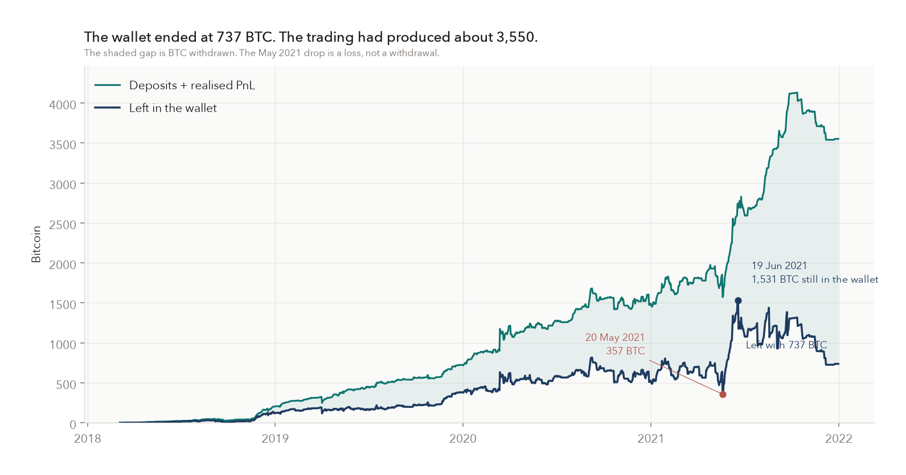
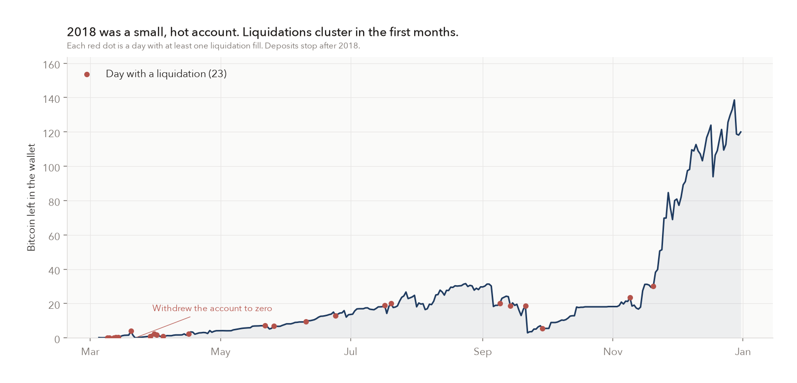
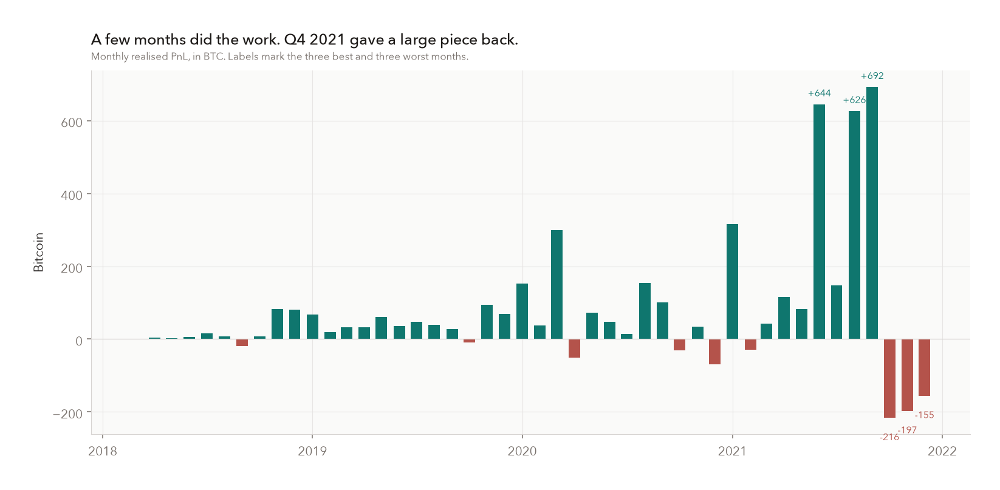
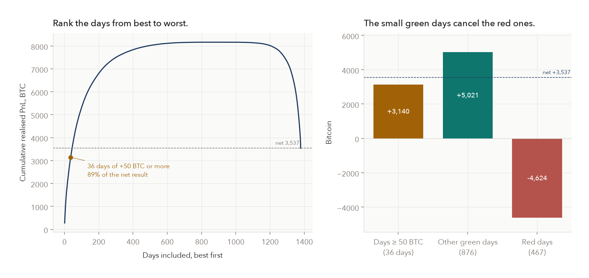
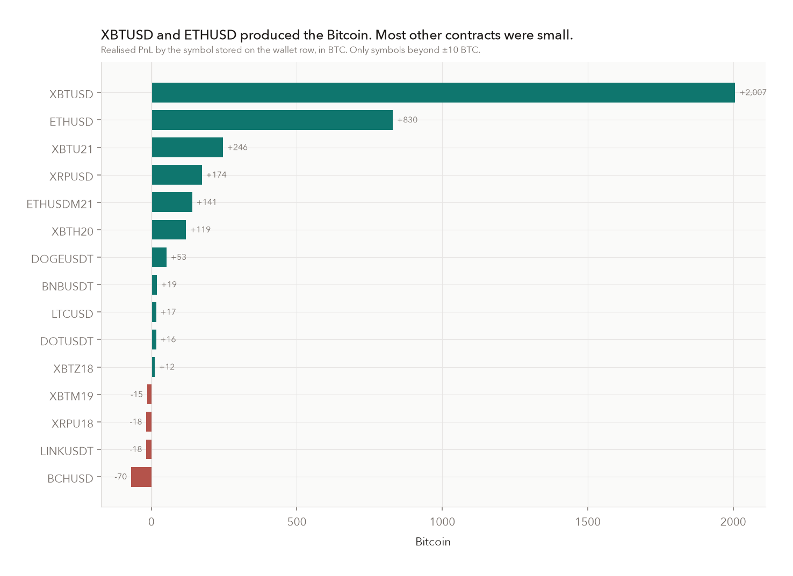
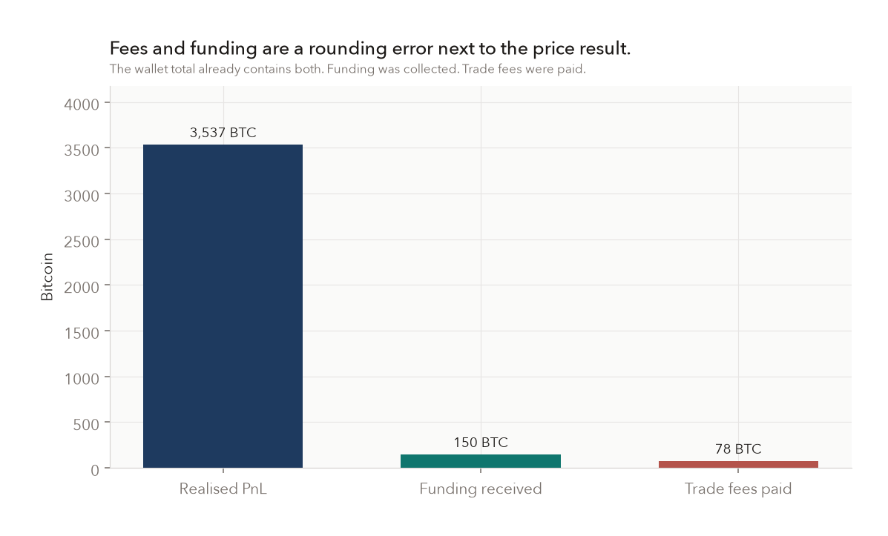
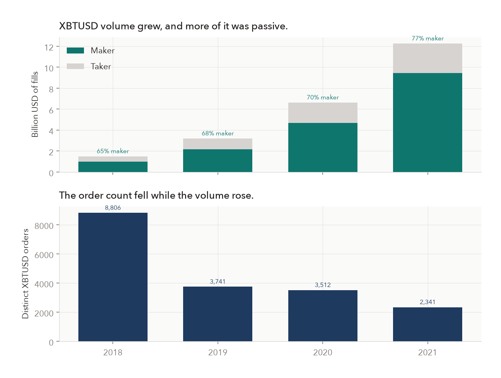
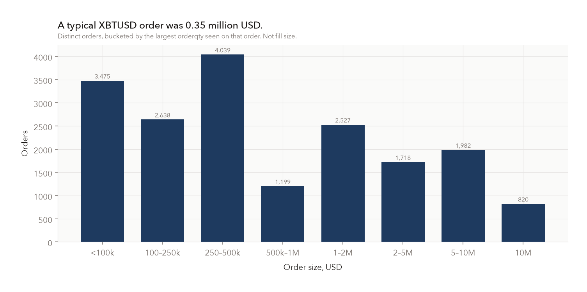
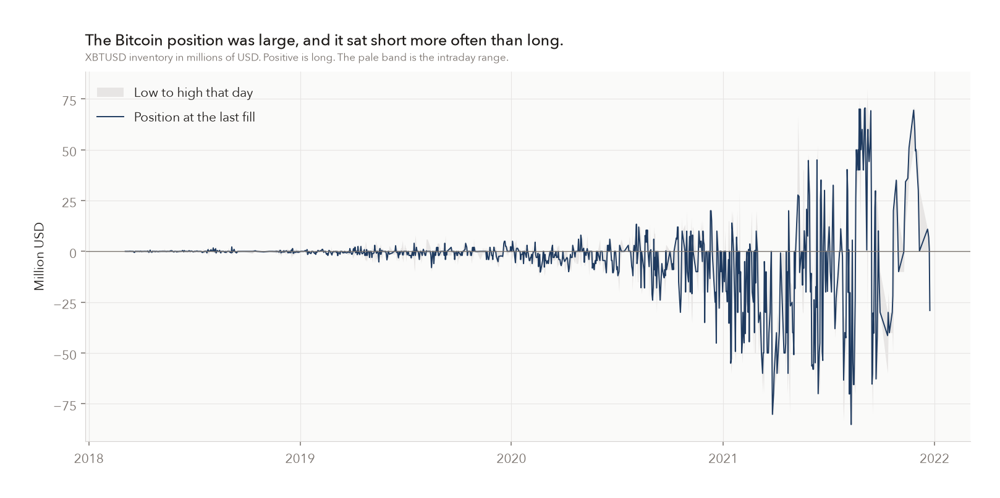
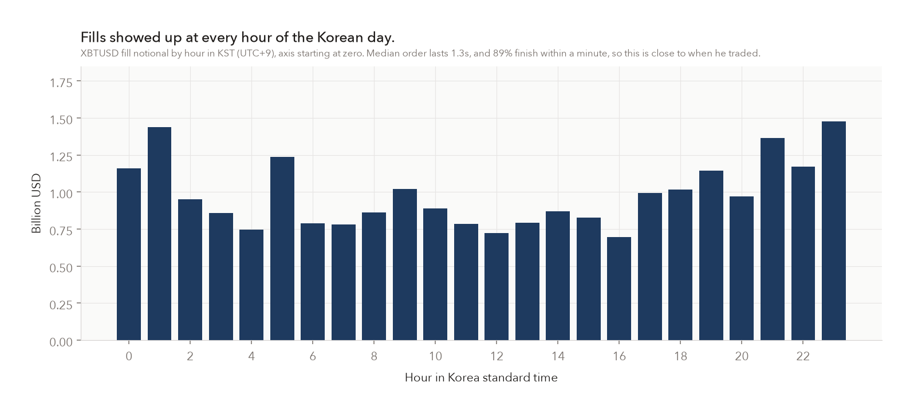

# Wonyotti BitMEX results, 2018–2021

Account `aoa` on BitMEX, 5 March 2018 through 31 December 2021. He deposited 14.5 BTC, all of it in 2018, and the first deposit was 0.172 BTC. Realised PnL was 3,537 BTC. He withdrew 2,815 BTC. The wallet finished at 737 BTC. The charts below are the evidence for that, and for how the orders were built.

Regenerate them from the repo root:

```bash
python3 analysis/make_charts.py
```

The script reads `data/` and writes `docs/figures/`. Dependencies are in `analysis/requirements.txt`.

The wallet CSV is not in date order, and once the balance passed about 1,000 BTC Excel stored `walletbalance` in scientific notation. The equity line is the running sum of the `amount` column after sorting by date. Do not cumulate the file in the order it is written.

## Equity



The teal line is deposits plus realised PnL. The navy line is what was still in the wallet. The shaded gap is BTC already withdrawn.

The wallet high is 1,531 BTC on 19 June 2021. On 20 May 2021 the wallet was 357 BTC. That day was a realised loss of about 282 BTC, and the gap between the two lines did not change, so the drop is a loss rather than a withdrawal. After June the teal line keeps climbing into October, while the navy line peels off as the large round-number withdrawals go out. The teal line itself peaks at 4,131 BTC on 12 October 2021 and then gives back 591 BTC by 22 December, a 14% decline in Bitcoin produced. The deeper decline in the wallet after June is mostly cash leaving.



2018 is a different account. There are 23 days with a liquidation fill, crowded into the first months. On 22 March 2018 he withdrew the balance to zero and came back a week later. Deposits stop in November 2018. By year-end the wallet is about 120 BTC.

## Where the Bitcoin came from



Three months dominate: September 2021 (+692 BTC), June 2021 (+644), August 2021 (+626). March 2020 is the earlier spike, near +300 BTC. October, November, and December 2021 are the three worst months (−216, −197, −155).



1,379 days have a realised-PnL row, and 912 of them are green. The median day is about +0.22 BTC. Thirty-six days of +50 BTC or more add up to +3,140 BTC, 89% of the net +3,537. The other 876 green days add +5,021, and the 467 red days subtract 4,624. The ordinary days cancel.



XBTUSD is +2,007 BTC. ETHUSD is +830. A few dated Bitcoin futures and XRPUSD matter after that. BCHUSD is the largest loss, at −70 BTC. Symbols inside ±10 BTC are omitted.



Funding received was 150 BTC. Trade fees paid were 78 BTC. Both sit inside the 3,537, and neither is the business.

## How the orders worked



XBTUSD fill volume went from 1.5 billion USD in 2018 to 12.3 billion in 2021. Maker share of that volume went from 65% to 77%. Distinct XBTUSD orders went from 8,806 to 2,341. Fewer orders, much more size, and more of each order left resting after it crossed.



The median XBTUSD order is 350,000 USD. The common large clips are 5 million and 10 million. A typical order then prints many partial fills. The median order is finished in 1.3 seconds, and 89% are finished within a minute. These are bursts, not quotes left up overnight. The position those bursts leave behind is what persists.



Positive is long, in millions of USD. Through 2020 the book is small on this scale. In 2021 it swings to about +80 million and −85 million. About half of Bitcoin trading days end short, about a quarter end long, and about a quarter end within 1,000 USD of flat. The last Bitcoin trade in the export, 24 December 2021, leaves a short of 29.1 million USD. That open position is not inside the realised PnL.



Because the orders finish in seconds, the hour of the fill is close to the hour he traded. XBTUSD volume shows up in every hour of Korea standard time. The quietest hour is still about 0.70 billion USD over the whole sample, and the busiest is about 1.48 billion.
